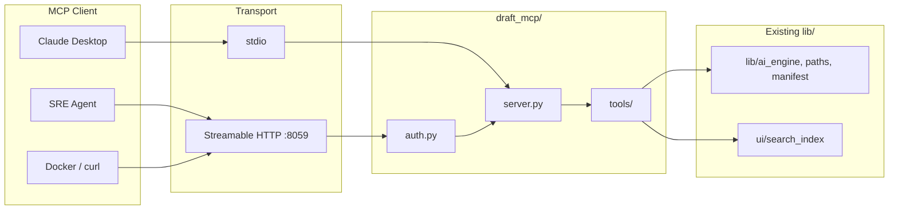

# MCP Server Design

## Context

Draft exposes document search, RAG Q&A, source management, and vault operations through a FastAPI app. Building an MCP server on top of it lets AI assistants (Claude Desktop, Claude Code, SRE agents, or any MCP-compliant client) use Draft as a live knowledge-base tool — searching docs, retrieving semantic chunks, and reading raw content.

**Primary use case:** Any MCP client — LLM or function-based — that needs to query a curated document set (engineering docs, runbooks, proprietary knowledge bases).

---

## Design principles

Draft's MCP server must be:

- **Retrieval-first** — the server's job is to retrieve and surface content; synthesis is the client's job. `retrieve_chunks` is the primary tool for LLM clients.
- **Read-only** — no write operations that change repo registration, config, or trigger pulls/rebuilds from the MCP layer. Admin ops (pull, rebuild, add_source) belong in the CLI/UI.
- **Low latency** — fast tools return quickly; no async task complexity.
- **Lightweight** — minimal dependencies, low resource footprint; easy to run alongside the UI or in a container.
- **Optional security** — Bearer token auth; optional SSL/TLS via reverse proxy. Stdio for local trusted use.
- **Auditable** — every request and response is traceable (request IDs, structured logs).
- **Observable** — performance and reliability are measurable (latency, error rates, OTel spans).

### Architecture



---

## Why `retrieve_chunks` is the primary tool (not `query_docs`)

RAG = retrieve chunks → feed to LLM → synthesize answer.

When the MCP client is an LLM, the client IS the synthesis step. Calling `query_docs` would ask Draft's LLM to synthesize an answer, which the client LLM then re-processes — double inference, mismatched context, higher cost. `retrieve_chunks` returns the raw ranked chunks; the client does synthesis itself.

`query_docs` is retained for non-LLM clients (scripts, monitoring agents, dashboards) that want a complete answer without their own synthesis step.

### SRE Runbook use case

Draft is the right candidate for K8 runbook storage — it already handles doc ingestion (GitHub/local), chunking, vector indexing, and FTS. Adding S3 or other cloud doc roots later would require minimal code change (sync to a path under DRAFT_HOME; see engineering.md §7.1). A dedicated MCP inside the SRE agent would duplicate all of this unnecessarily.

A conceptual flow:
```
K8 cluster → SRE agent detects OOMKilled
SRE agent (SudoRoot) calls draft MCP: retrieve_chunks("OOMKilled pod memory limit exceeded", top_k=5)
Draft returns: [{heading, text, repo, path, score, start_line, end_line}]
SRE agent LLM synthesizes diagnosis + remediation steps
...
```

---

## Package naming: `draft_mcp/` (not `mcp/`)

The local package is named `draft_mcp/` to avoid shadowing the installed `mcp` SDK. If the directory were named `mcp/`, any `from mcp import FastMCP` inside server.py would resolve to the local package rather than the SDK.

---

## 1. Architecture: direct `lib/` import

The MCP server does **not** call `http://localhost:8058`. It imports from `lib/` and `ui/search_index` directly:

- No round-trip latency
- No dependency on the UI server being up
- Shared DRAFT_HOME / path resolution via `lib/paths.py`
- Direct access to `ask_stream()`, `retrieve()`, `rerank()`, `search()`, `parse_sources_yaml()`

### Directory structure: `draft_mcp/`

```
draft_mcp/
  __init__.py
  server.py          # FastMCP server: tools, resources, prompts, HTTP+stdio entrypoints
  auth.py            # Bearer token Starlette middleware
  errors.py          # MCP error type wrappers
  instrumentation.py # OTel span + metrics + structured log per tool call
  tools/
    __init__.py
    search.py        # search_docs, retrieve_chunks
    documents.py     # get_document, list_documents
    sources.py       # list_sources
    ask.py           # query_docs (optional, non-LLM clients)

scripts/
  serve_mcp.py       # Entrypoint: --stdio or Streamable HTTP on :8059
```

### Tool-to-lib mapping

| MCP Tool          | Calls                                         | Module                           |
| ----------------- | --------------------------------------------- | -------------------------------- |
| `search_docs`     | `search_index.search()`                       | `ui/search_index.py`             |
| `retrieve_chunks` | `ai_engine.retrieve()` + `ai_engine.rerank()` | `lib/ai_engine.py`               |
| `query_docs`      | `ai_engine.ask_stream()` (collected)          | `lib/ai_engine.py`               |
| `get_document`    | `paths.get_effective_repo_root()` + file read | `lib/paths.py`                   |
| `list_documents`  | walk repo root + `ingest.should_include()`    | `lib/paths.py` + `lib/ingest.py` |
| `list_sources`    | `manifest.parse_sources_yaml()`               | `lib/manifest.py`                |

---

## 2. SDK Selection

**Chosen:** official `mcp` SDK using the **high-level `FastMCP` class** for tool/resource/prompt definitions, dropping to the **low-level Starlette app** (`streamable_http_app()`) for auth middleware.

- `FastMCP` decorator API (`@mcp.tool()`) — one function per tool, concise
- `mcp.streamable_http_app()` returns a `Starlette` app → `add_middleware(BearerTokenMiddleware)` sits cleanly at the transport layer
- Spec-aligned, officially maintained, stable for long-term Docker/k8s deployment

```
pip install mcp>=1.0
```

---

## 3. Transport Protocol

**Primary: Streamable HTTP (MCP spec 2025-03-26), port 8059**
**Secondary: stdio (Claude Desktop / local integration)**

```
--stdio flag   →  stdio transport   (Claude Desktop, local, no auth)
(default)      →  Streamable HTTP on port 8059 (with Bearer token auth)
```

### Claude Desktop config (local use)

```json
{
  "mcpServers": {
    "draft": {
      "command": "python",
      "args": ["scripts/serve_mcp.py", "--stdio"],
      "env": { "DRAFT_HOME": "/Users/user/.draft" }
    }
  }
}
```

### HTTP / remote use

```
POST http://localhost:8059/mcp
Authorization: Bearer <DRAFT_MCP_TOKEN>
```

---

## 4. Tool & Resource Specification

### Tools

**`search_docs`** — fast FTS
- Input: `{query: str, limit: int = 20}`
- Output: `[{repo, path, snippet}]`
- Source: `ui.search_index.search()`
- No LLM or vector index required

**`retrieve_chunks`** — primary semantic tool
- Input: `{query: str, top_k: int = 5, rerank: bool = True}`
- Output: `[{repo, path, heading, text, score, start_line, end_line}]`
- Source: `ai_engine.retrieve()` + `ai_engine.rerank()`
- Returns raw ranked chunks; the MCP client (LLM) synthesizes the answer
- Requires a built vector index

**`get_document`**
- Input: `{repo: str, path: str}`
- Output: `{content: str, repo: str, path: str, size_bytes: int}`
- Source: `paths.get_effective_repo_root()` → read file

**`list_documents`**
- Input: `{repo: str}`
- Output: `[{path: str, size_bytes: int}]`
- Source: walk effective repo root filtered by `ingest.should_include()`

**`list_sources`**
- Input: none
- Output: `[{name: str, source: str, url: str|None, doc_count: int}]`
- Source: `manifest.parse_sources_yaml()` + walk counts

**`query_docs`** — optional, non-LLM clients
- Input: `{question: str}`
- Output: `{answer: str, citations: [{repo, path, heading, score, start_line, end_line, snippet}]}`
- Source: `ai_engine.ask_stream()` (collected internally, returned complete)
- Requires LLM configured in `.env` and a built vector index
- LLM clients should use `retrieve_chunks` instead

### Resources

**`draft://sources`**
- Returns JSON of all sources with doc counts

**`draft://doc/{repo}/{path}`**
- Returns raw document content (mirrors `get_document` as a resource URI)

### Prompt

**`answer_from_docs`**
- Guides LLM clients: use `retrieve_chunks` for synthesis, `search_docs` for keywords, `get_document` for full text. Cite by repo and path.

---

## 5. Production-Grade Requirements

### Auth: Bearer token middleware

All HTTP transport requests require:

```
Authorization: Bearer <DRAFT_MCP_TOKEN>
```

Token set in `.env` as `DRAFT_MCP_TOKEN`. If unset, the server auto-generates a random token on startup and prints it once to stderr. Requests without a valid token receive `401` before any tool logic runs. `draft_mcp/auth.py` implements `BearerTokenMiddleware` (Starlette). stdio skips auth (inherently local/trusted).

### Input validation

Tool inputs are validated by FastMCP via function signatures and type annotations. Invalid inputs return structured MCP errors.

### Error handling

`draft_mcp/errors.py` defines error types raised by tools:

| Error              | Condition                          |
| ------------------ | ---------------------------------- |
| `IndexNotReady`    | No vector store built yet          |
| `SourceNotFound`   | Repo name not in sources.yaml      |
| `DocumentNotFound` | Path doesn't exist in repo         |
| `LLMNotConfigured` | No provider set up in `.env`       |

### Structured logging

Each tool call emits a JSON log line via `draft_mcp/instrumentation.py`:

```json
{"level": "info", "tool": "retrieve_chunks", "request_id": "uuid4", "duration_ms": 42.3, "status": "ok"}
```

### Timeouts

| Tool category            | Timeout |
| ------------------------ | ------- |
| Fast tools               | 10s     |
| `query_docs` (RAG + LLM) | 120s    |

### Health endpoint (HTTP transport only)

```
GET http://localhost:8059/health
→ {"status": "ok", "llm_ready": bool, "index_ready": bool, "version": str}
```

Used by Docker `HEALTHCHECK` and k8s liveness probes.

### Observability

One OTel span per tool call (`mcp.tool.<name>`) with `request_id` and `transport` attributes. Structured JSON log line per call. See [observability_design.md](observability_design.md) for full propagation and metrics schema.

---

## Verification

1. **Import check:**
   ```bash
   python -c "from draft_mcp.server import mcp; print([t.name for t in mcp._tool_manager.list_tools()])"
   # → ['search_docs', 'retrieve_chunks', 'get_document', 'list_documents', 'list_sources', 'query_docs']
   ```
2. **stdio / Claude Desktop:** Add config to `claude_desktop_config.json` → ask "what docs do I have?" → `list_sources` returns repos
3. **HTTP / curl:**
   ```bash
   curl -X POST http://localhost:8059/mcp \
     -H "Authorization: Bearer <token>" \
     -H "Content-Type: application/json" \
     -d '{"jsonrpc":"2.0","id":1,"method":"tools/call","params":{"name":"search_docs","arguments":{"query":"RAG pipeline"}}}'
   ```
4. **Semantic search:** `retrieve_chunks("OOMKilled pod memory limit", top_k=5)` → ranked chunks from indexed docs
5. **Auth:** No token → `401`; wrong token → `401`; correct token → `200`
6. **query_docs:** No index → structured `IndexNotReady` error; with index + LLM → `{answer, citations}`
7. **Health:** `GET http://localhost:8059/health` → `{"status": "ok", "llm_ready": true, "index_ready": true}`

---

## Kubernetes Deployment

The MCP server is the primary Kubernetes deployment target (Helm chart at `kubernetes/draft/`). Sources are injected via ConfigMap and hostPath mounts — no `pull.py` runs in-pod.

→ **[Container orchestration](container_orchestration.md)** — infrastructure design, Helm values, Docker, and full K8s operational runbook.
