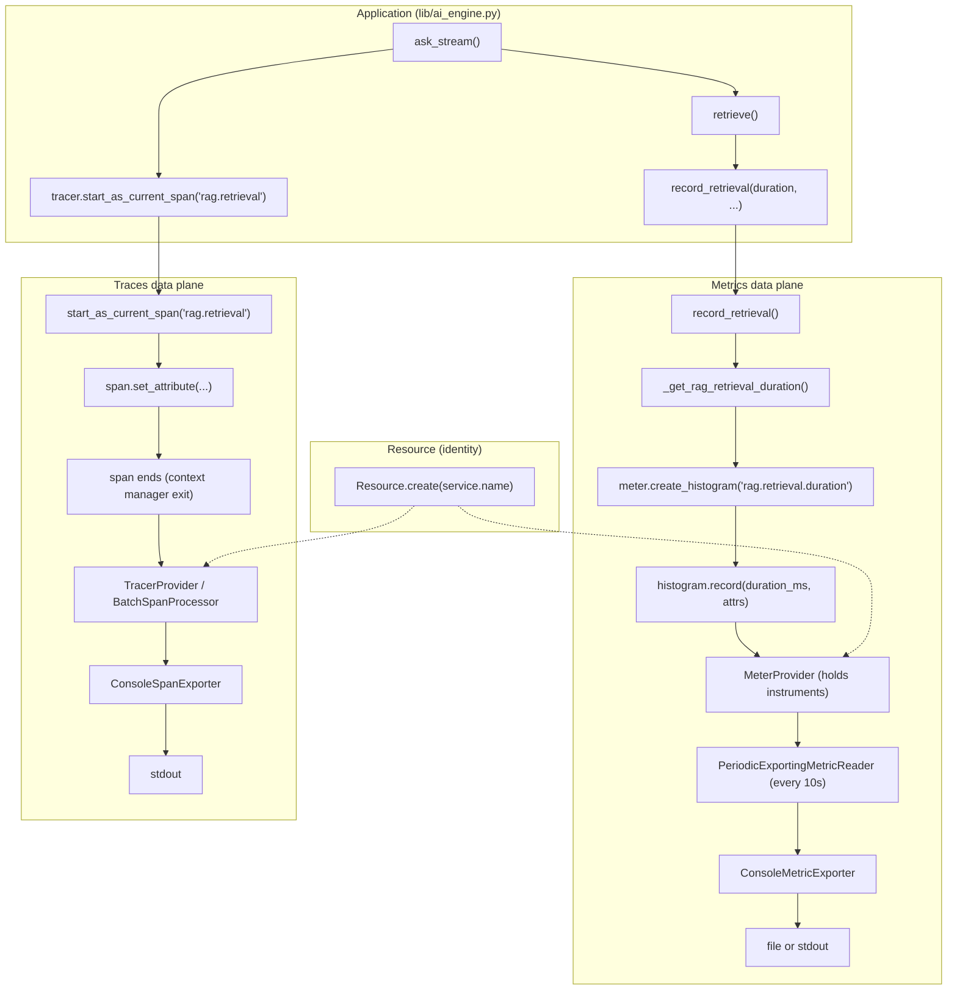

# OTel walkthrough: from resource to console output

This document walks OpenTelemetry in the Draft codebase in **data-flow order**. We follow **one example**: the **metric** `rag.retrieval.duration` (retrieval stage latency). **Step 1** is the Resource that labels all telemetry; **Step N** is the rendered metric line (default: `~/.draft/otel_metrics.log`, or stdout if overridden).

---

## Live demo: metrics when Draft is running

To see metrics and spans **live** while using the Draft UI or CLI:

1. **Install OTel packages (optional)**  
   From repo root: `pip install -r requirements-otel.txt`. Without this, OTel is no-op and Draft runs unchanged.

2. **OTel runs by default**  
   Entry points call `configure_otel()` at startup, so no env var is required. Optionally set `OTEL_SERVICE_NAME` (e.g. `draft-ui`) to set the service name. Do **not** set `OTEL_EXPORTER_OTLP_ENDPOINT` if you want metrics in the log file (or console); if you set it, metrics and traces go to that OTLP endpoint.

3. **Start Draft and trigger RAG**
   - **UI:** `python scripts/serve.py` — open http://localhost:8058 → use **Ask** (type a question, submit).
   - **CLI:** `python scripts/ask.py` (with your index and query as usual).

4. **Where metrics go** (when not using OTLP):
   - **Default:** Metrics are written to **`~/.draft/otel_metrics.log`** (or `$DRAFT_HOME/otel_metrics.log`). The file is appended to; the directory is created if needed.
   - **Override:** Set **`DRAFT_OTEL_METRICS_LOG=stdout`** to print metrics to the terminal, or **`DRAFT_OTEL_METRICS_LOG=/path/to/file.log`** for another file. Applied in `lib/otel.py` when the console exporter is used.
   - **Spans** go to stdout (terminal) unless you use OTLP.

5. **On exit:** Entry points call `shutdown_otel()` so the final metric batch is flushed (otherwise the 10s periodic reader would drop it).

So: with the OTel SDK installed, run Draft and use Ask; read metrics from `~/.draft/otel_metrics.log` (or stdout if overridden). For an OTLP backend (e.g. Grafana, Jaeger), set `OTEL_EXPORTER_OTLP_ENDPOINT` to the collector URL.

---

## Example: one RAG request

When you run `python scripts/ask.py` with the OTel SDK installed and no `OTEL_EXPORTER_OTLP_ENDPOINT`, metrics are written to `~/.draft/otel_metrics.log` (or stdout if `DRAFT_OTEL_METRICS_LOG=stdout`) about every 10 seconds, and spans when they end.

**Concrete example:** the histogram `**rag.retrieval.duration`** (retrieval stage latency in ms). You might see it in console output like:

```
...
# metric point: rag.retrieval.duration, value: 45.2, attributes: {rag.embed_model: ..., rag.top_k: 20}
...
```

Below we trace **how that point got there** in forward order: Step 1 = Resource → … → Step N = console output.

---

## Forward flow: metrics (Step 1 → Step N)


| Step  | What you have                                               | Component                              | Who creates it                                                                | Where in code                                                                                                           |
| ----- | ----------------------------------------------------------- | -------------------------------------- | ----------------------------------------------------------------------------- | ----------------------------------------------------------------------------------------------------------------------- |
| **1** | Identity attached to every metric (and span)                | **Resource**                           | Created once and passed to both TracerProvider and MeterProvider              | `lib/otel.py` L120: `resource = Resource.create(...)`; L131, L155: `resource=resource`                                  |
| **2** | One-time setup of providers and global meter/tracer         | **configure_otel()**                   | Entry points call it at startup by default                                    | `lib/otel.py` L93–158; called from `ui/app.py` lifespan, `scripts/ask.py`, `scripts/serve_mcp.py`                       |
| **3** | Provider that holds instruments and is tagged with Resource | **MeterProvider**                      | We create it with `resource` and the reader                                   | `lib/otel.py` L155: `_meter_provider = MeterProvider(resource=resource, metric_readers=[reader])`                      |
| **4** | Meter used to create instruments                            | **get_meter()** / **_meter**           | We get it via `metrics.get_meter(name, "1.0.0")` and store in `_meter`         | `lib/otel.py` L76–78: `get_meter()`; L157: `_meter = metrics.get_meter(name, "1.0.0")`                                  |
| **5** | Instrument that records retrieval duration                  | **Histogram** `rag.retrieval.duration` | Created by the meter at first use                                             | `lib/metrics.py` L45–47: `_get_rag_retrieval_duration()` → `meter.create_histogram(...)`                                 |
| **6** | Application code that runs retrieval and emits the metric   | **ask_stream()**                       | After retrieval, it calls `record_retrieval(...)`                             | `lib/ai_engine.py` L361: `record_retrieval(time.perf_counter() - t_ret, ...)`                                            |
| **7** | Call that writes a value into the histogram                 | **record_retrieval()**                 | Our wrapper; calls `_get_rag_retrieval_duration().record(duration_ms, attrs)`  | `lib/metrics.py` L116–120: `record_retrieval()`; L118: `_get_rag_retrieval_duration().record(...)`                      |
| **8** | Reader that periodically pulls from the provider            | **PeriodicExportingMetricReader**      | We create it with the exporter and a 10s interval                             | `lib/otel.py` L154: `reader = PeriodicExportingMetricReader(metric_exporter, export_interval_millis=10_000)`            |
| **9** | Exporter that receives batched metric data                  | **ConsoleMetricExporter**              | We wire it with `out=` file (default: `otel_metrics.log`) or stdout          | `lib/otel.py` L137–154: console path uses `ConsoleMetricExporter(out=_out)`                                              |
| **N** | Rendered metric line                                        | **Log file or stdout**                 | Exporter writes to `~/.draft/otel_metrics.log` (default) or stdout            | Final output; `shutdown_otel()` at exit flushes the last batch.                                                         |


So: **Resource** (step 1) is created in `configure_otel()` and attached to the **MeterProvider** (step 3). The **meter** (step 4) from that provider is stored in `_meter`. **Instruments** (step 5) such as `rag.retrieval.duration` are created lazily in `lib/metrics.py` via `get_meter()`. **Application code** (step 6) in `lib/ai_engine.py` calls `record_retrieval()` after the retrieval stage; that (step 7) calls `histogram.record()`. The **PeriodicExportingMetricReader** (step 8) periodically collects from the provider and sends to the **ConsoleMetricExporter** (step 9), which writes to the metrics log file (default) or stdout. **shutdown_otel()** at exit flushes the final batch (step N).

---

## Forward flow: traces/spans (same idea)

Spans (e.g. `rag.retrieval`) follow the same order: Resource first, console output last.


| Step  | What you have                    | Component                                  | Where in code                                                                                                                    |
| ----- | -------------------------------- | ------------------------------------------ | -------------------------------------------------------------------------------------------------------------------------------- |
| **1** | Same Resource                    | **Resource**                               | `lib/otel.py` L120, L131                                                                                                         |
| **2** | One-time setup                   | **configure_otel()**                       | `lib/otel.py` L93–158                                                                                                            |
| **3** | Provider that owns the tracer    | **TracerProvider**                         | `lib/otel.py` L131: `_tracer_provider = TracerProvider(resource=resource)`                                                      |
| **4** | Tracer used to create spans      | **get_tracer()** → `_tracer`               | `lib/otel.py` L72–74, L134: `_tracer = trace.get_tracer(name, "1.0.0")`                                                         |
| **5** | Span created and attributes set  | **start_as_current_span("rag.retrieval")** | `lib/ai_engine.py` L356–360: `with tracer.start_as_current_span("rag.retrieval") as ret_span:` and `ret_span.set_attribute(...)` |
| **6** | Processor invoked when span ends | **BatchSpanProcessor**                     | `lib/otel.py` L132: `_tracer_provider.add_span_processor(BatchSpanProcessor(span_exporter))`                                    |
| **7** | Exporter that receives span data | **ConsoleSpanExporter**                    | `lib/otel.py` L117, L130: `span_exporter = ConsoleSpanExporter()`                                                                |
| **N** | Span line on stdout              | **Console output**                         | Exporter writes; you see the span.                                                                                              |


So: the **Resource** is shared by both **TracerProvider** and **MeterProvider**. Spans and metrics both carry the same `service.name` (and any other resource attributes).

---

## Data plane: metrics and traces

The diagram below shows the **data plane** for one RAG request: where data is produced (application), where it is aggregated (instruments / span processor), and where it is exported (console).




- **Application:** produces events (retrieval done → record metric; enter/exit span).
- **Metrics plane:** `record_retrieval()` → lazy instrument (histogram) → MeterProvider → reader → ConsoleMetricExporter → metrics log file (default) or stdout. Resource is attached to MeterProvider. `shutdown_otel()` at exit flushes the last batch.
- **Traces plane:** `start_as_current_span` → span lifecycle → TracerProvider / BatchSpanProcessor → ConsoleSpanExporter → stdout (or OTLP). Resource is attached to TracerProvider.
- **Resource:** created once in `configure_otel()` and attached to both providers; it does not create metrics or spans by itself—it **labels** them (e.g. `service.name`).

---

## File map (quick reference)


| Concern                                              | File                                                  | What it does                                                                                                                                                                              |
| ---------------------------------------------------- | ----------------------------------------------------- | ----------------------------------------------------------------------------------------------------------------------------------------------------------------------------------------- |
| Resource, providers, exporters, shutdown              | `lib/otel.py`                                         | `Resource.create()`, `configure_otel()`, `shutdown_otel()`, TracerProvider, MeterProvider, Console/OTLP exporters, metrics log file (default `otel_metrics.log`), global `_tracer`/`_meter`. |
| Instruments and record_*                             | `lib/metrics.py`                                      | Lazy `_get_*()` calling `get_meter()`, `create_counter`/`create_histogram`, `record_retrieval`, `record_rerank`, `record_llm_duration`, `record_rag_request`, etc.                        |
| RAG: spans and metrics calls                         | `lib/ai_engine.py`                                    | `get_tracer()`, `start_as_current_span("rag.ask" | "rag.retrieval" | "rag.rerank" | "rag.generation")`, `record_retrieval`, `record_rerank`, `record_llm_duration`, `record_rag_request`. |
| MCP: spans and metrics                               | `mcp/instrumentation.py`                              | `get_tracer()`, `instrument_tool_call()` → span `mcp.tool`, `record_mcp_tool_call`, `record_mcp_tool_duration`.                                                                           |
| OTel startup and shutdown                            | `ui/app.py`, `scripts/ask.py`, `scripts/serve_mcp.py` | Call `configure_otel(service_name=...)` at startup by default; call `shutdown_otel()` on exit (lifespan after yield, `finally`, `atexit`).                                                                 |


---

## Takeaway

- **Step 1:** The **Resource** is created first in `configure_otel()` with `Resource.create({"service.name": name})` and passed into both TracerProvider and MeterProvider. It does not generate metrics or spans; it **tags** all telemetry from this process with that identity.
- **Steps 2–4:** **configure_otel()** sets up providers and global **get_meter()** / **get_tracer()**. MeterProvider and TracerProvider hold the Resource.
- **Steps 5–7:** **Instruments** (histogram/counter) and **spans** are created and used by **application code** via `record_*()` and `tracer.start_as_current_span()`. Data flows into the providers.
- **Steps 8–9:** **PeriodicExportingMetricReader** and **BatchSpanProcessor** collect from the providers and pass data to the exporters.
- **Step N:** The **ConsoleMetricExporter** writes metric lines to the metrics log file (default `~/.draft/otel_metrics.log`) or stdout if `DRAFT_OTEL_METRICS_LOG=stdout`. The **ConsoleSpanExporter** writes span lines to stdout (or OTLP). **shutdown_otel()** at exit flushes the final metric batch.

