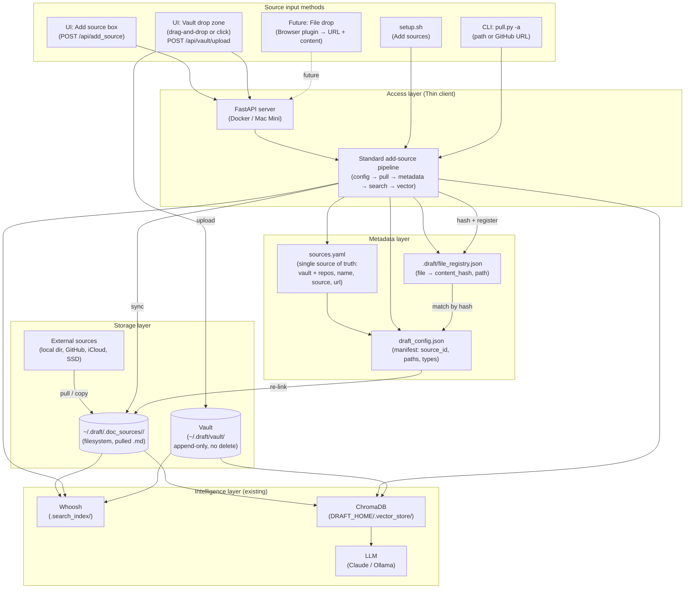
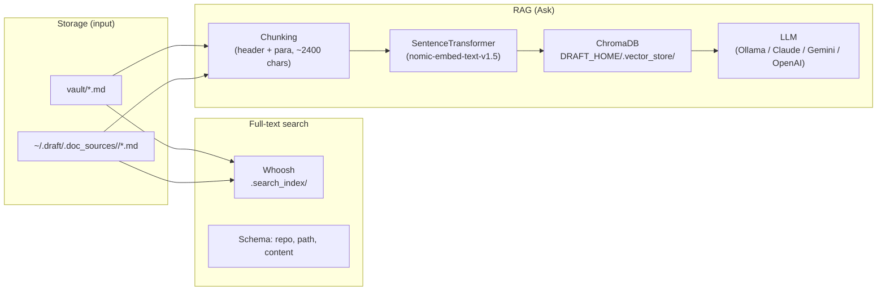

# Draft Engineering

This document is a **single engineering reference** for Draft. It combines design principles, storage and metadata, core implementations, the intelligence layer (search and RAG), and the local oracle (Ask) into one place. Content is ordered **from basic to core** so you can read top-to-bottom to understand how Draft works.

**How to use it:**

| If you want to… | Start here |
|-----------------|------------|
| Understand what Draft tracks and how (sources, operations) | §1 Design principles |
| See where data lives and how paths are resolved | §2 Storage layout and path abstraction |
| Understand the metadata layer, vault, and reconnection | §3 Metadata layer and vault |
| Know what happens when you add a source or pull | §4 Add-source and pipeline behavior |
| Understand search (Whoosh) and Ask (RAG, Chroma, LLM) | §5 Intelligence layer: search and RAG |
| Get the “local oracle” goals and how to run Draft | §6 Local oracle: goals and usage |
| See what’s planned (re-link, file registry, browser drop) | §7 Future and implementation order |

---

## 1. Design principles

**Data sources and operations**

Draft supports six source types. How each is added and whether Draft copies or reads in-place is fixed by type:
(x_post along with browser plugin drop features are W.I.P.)

| Type | Description | Storage under DRAFT_HOME | Copy/pull policy | Pull operation |
|------|-------------|--------------------------|------------------|----------------|
| **vault** | User-managed upload area | `vault/` | User uploads; append-only | None |
| **github** | Remote GitHub repo (user provides URL) | `.clones/<name>/` | Draft owns the clone | `git clone` / `git pull` |
| **local_dir** | Local directory (no git remote) | None (read in-place) | No copy | None |
| **local_git** | Local git repo (has `url` from origin) | None (read in-place) | No copy | None (`url` is display only) |
| **local_file** | Local single `.md` file | None (read in-place) | No copy | None |
| **x_post** | X/Twitter post URL | `.x_posts/<name>/` (future) | Draft fetches once | None (fetch-on-add; not yet implemented) |

**Operations by type:**

1. **github** — Clone to `~/.draft/.clones/<name>` (or pull); record in `sources.yaml` with `source` (URL) and `url`. Draft runs Pull (git pull).
2. **local_dir** — Entry in `sources.yaml` with path as `source`. Read in-place; no copy, no pull.
3. **local_git** — Same as local_dir; `url` is backfilled from the repo’s origin (display/linking only). No `git pull` — user manages their own repo.
4. **local_file** — Entry in `sources.yaml` with file path as `source`. Read in-place; appears as a single-file repo in tree, search, and RAG.
5. **x_post** — Record URL in `sources.yaml`; fetch and store under `~/.draft/.x_posts/<name>/`. (Fetching not yet implemented.)
6. **vault** — `~/.draft/vault/`; populated via UI upload or save-from-doc. Not pulled from any external source.

**AI vector indexing and search:** The RAG index (`lib/ingest.py`) and full-text search (`ui/search_index.py`) must handle all source types: directories are walked recursively; single files (`local_file`) are chunked directly.

**Architectural answers**

- **sources.yaml** is the metadata layer and the single source of truth for what Draft tracks. **draft_config.json** (the manifest) is a derived cache — always regenerated from `sources.yaml`; never hand-edited.
- Draft reads content in-place wherever possible. The only data Draft copies or creates under `~/.draft/` is:
  - `.clones/<name>/` — git clones of GitHub sources (Draft owns these)
  - `.x_posts/<name>/` — fetched X post content (Draft owns these)
  - `vault/` — user uploads
  - `.search_index/` and `.vector_store/` — derived indexes (rebuildable)

**Core principles**

1. Draft is a **reader**, not a repo manager. It does not run `git pull` on repos the user is actively developing.
2. Keep data **in-place** wherever possible to avoid content drift and reduce duplication.
3. `sources.yaml` defines each content source and its allowed operations; the source type taxonomy encodes those rules.

---

## 2. Storage layout and path abstraction

### 2.1 Storage layout under DRAFT_HOME (`~/.draft/`)

```
~/.draft/
├── sources.yaml          # source of truth — tracked sources
├── vault/                # user uploads (vault source type)
├── .clones/              # git clones of GitHub sources
│   └── <name>/
├── .x_posts/             # fetched X/Twitter post content (future)
│   └── <name>/
├── .doc_sources/        # (optional) copied/synced docs from local sources
│   └── <name>/
├── .cache/huggingface/  # HF embed/encoder models (checked before download)
├── .search_index/       # Whoosh FTS index (derived; rebuildable)
└── .vector_store/       # ChromaDB vector index (derived; rebuildable)
```

Draft repo root also has:

```
<draft_root>/
└── .draft/
    └── draft_config.json   # manifest (derived from sources.yaml; never hand-edited)
```

### 2.2 get_effective_repo_root() — unified path abstraction

`lib/paths.get_effective_repo_root(name, source, draft_root)` is the single function all layers use to resolve “where do I read content for this source?”:

- **GitHub:** returns `~/.draft/.clones/<name>` (directory)
- **Local dir / local git:** returns the resolved absolute path (directory)
- **Local file:** returns the resolved absolute path to the file (file, not directory)
- **x_post / vault:** callers use `get_x_posts_root()` / `get_vault_root()` directly

Callers must check `.is_dir()` or `.is_file()` on the returned path. The function never creates paths; it returns a path that may not exist.

### 2.3 sources.yaml → manifest flow

```
sources.yaml  →  lib/manifest.build_manifest()  →  .draft/draft_config.json
```

- `sources.yaml` is written by `pull.py -a` (add) and the UI add/remove endpoints.
- `lib/manifest.update_manifest()` is called after every pull and source add/remove.
- `draft_config.json` records `source_type`, `source`, optional `url`, and `resolved_path` (if the path/clone exists on disk).
- `draft_config.json` is a cache for tooling; the authoritative state is always `sources.yaml`.

**Type detection (`_source_type()`):**

1. Name == `vault` → `vault`
2. `github.com` in source → `github`
3. `x.com/` or `twitter.com/` in source → `x_post`
4. Source path has `.md` suffix → `local_file`
5. Has `url` → `local_git`
6. Otherwise → `local_dir`

### 2.4 Operations matrix per source type

| Operation | vault | github | local_dir | local_git | local_file | x_post |
|-----------|-------|--------|-----------|-----------|------------|--------|
| Add to sources.yaml | via upload/UI | `pull -a <url>` | `pull -a <path>` | `pull -a <path>` | `pull -a <file>` | UI (future) |
| Pull | — | `git pull` | echo "up to date" | echo "up to date" | echo "up to date" | — |
| URL backfill | — | — | — | yes (from git remote) | — | — |
| FTS index | `_add_repo_to_writer` | `_add_repo_to_writer` | same | same | single-file branch | dir walk (future) |
| RAG index | dir walk | dir walk | dir walk | dir walk | single-file branch | dir walk (future) |
| UI tree | `_repo_tree_entry` | `_repo_tree_entry` | same | same | `_repo_file_entry` | same (future) |
| Remove | — | deletes `.clones/<name>` | sources.yaml only | sources.yaml only | sources.yaml only | deletes `.x_posts/<name>` |

### 2.5 Key implementation files

| File | Role |
|------|------|
| `lib/paths.py` | All DRAFT_HOME paths; `get_effective_repo_root()` |
| `lib/manifest.py` | `_source_type()`, `_resolved_path()`, `build_manifest()`, `update_manifest()` |
| `scripts/pull.py` | Add/pull sources; url backfill; GitHub clone/pull |
| `lib/ingest.py` | RAG chunking; `collect_chunks()` iterates all sources |
| `ui/search_index.py` | Whoosh FTS; `build_index()` iterates all sources |
| `ui/app.py` | FastAPI; tree building, doc serving, add/remove source endpoints |
| `lib/verify_sources.py` | Validates sources.yaml before manifest update |

---

## 3. Metadata layer and vault

**Scope:** Storage layer + access layer. **Goal:** Reconnect with storage after it is detached (content identity, path mapping). Support future browser-drop with URL as source.

**Data locations:** Doc data and config live under **`~/.draft/`** (or **`DRAFT_HOME`**): **`sources.yaml`**, **`.doc_sources/<source_id>/`** (or `.clones/` for GitHub), and **`vault/`**. Vault is separate from `.doc_sources/`.

### 3.1 Architecture diagram



**Legend:** Source input methods (setup, CLI, UI, vault drop) feed the add-source pipeline. **sources.yaml** is the single source of truth; **draft_config.json** (manifest) and **file_registry.json** (planned) are derived. Storage: vault at `~/.draft/vault/` (append-only); `.doc_sources/` (or `.clones/` for GitHub) for pulled docs. Intelligence: Whoosh, Chroma, LLM.

### 3.2 Principles

- **Draft “watches” files** — it does not own them. Sources can live on external drive, iCloud, GitHub. Pull/copy populates `~/.draft/.doc_sources/` (or `.clones/`) with `.md` files.
- **Content identity over path** — Track files by **content hash** (SHA-256). When the path changes (e.g. drive moved), **re-link** existing vectors to the new path instead of re-indexing. (Re-link and file registry are not yet implemented.)
- **Manifest is the single source of truth** for “what sources exist and where they map.” It is derived from `sources.yaml` and portable.
- **Vault is separate** — Vault lives at `~/.draft/vault/` (not under `.doc_sources/`) so it can later be pointed at encrypted S3, iCloud Drive, etc.

### 3.3 Vault behavior (implemented)

| Aspect | Behavior |
|--------|----------|
| **Source of truth** | Vault is listed in **sources.yaml** with `source: ./vault`. Same file defines vault and all other repos. |
| **Adding files** | **UI only:** Sidebar vault drop zone — drag-and-drop or click to open file picker. Both call `POST /api/vault/upload`. |
| **Append-only** | No delete. Duplicate filenames get a numeric suffix (e.g. `doc_1.md`). |
| **File list** | Not stored in a DB. On each `GET /api/tree`, the server **scans** `~/.draft/vault/` and builds the tree. |
| **Document types** | Global allowed: `.md`, `.txt`, `.pdf`, `.doc`, `.docx`. Same for vault and repos. |
| **Tree order** | Vault is always **first** in the tree when present. |

### 3.4 Artifacts and locations

| Artifact | Location | Role |
|----------|----------|------|
| **Sources list** | `~/.draft/sources.yaml` | Single source of truth: vault + all repos (name, source, url). |
| **Manifest** | `.draft/draft_config.json` at draft root | Generated from sources.yaml + resolved paths. Implemented. Verify required before build. |
| **Vault** | `~/.draft/vault/` | Separate from .doc_sources. Append-only; no delete. |
| **Doc store** | `~/.draft/.doc_sources/<source_id>/` or `.clones/<name>/` | Pull/copy writes here. Vault is not here. |
| **File registry** | `.draft/file_registry.json` | **Not yet implemented.** Planned: file → content_hash, path (for re-link). |
| **Vector store** | `DRAFT_HOME/.vector_store/` (Chroma) | Chunk embeddings + metadata. |
| **Search index** | `.search_index/` (Whoosh) | Full-text index; rebuildable from vault + doc sources. |

### 3.5 Single source of truth: sources.yaml vs manifest

- **sources.yaml** is the only human-edited config. People and the UI/CLI add or change sources here.
- **draft_config.json** is always **generated**, never hand-edited. It is produced from sources.yaml and resolved paths. Regenerate on pull/add-source or startup. **Verification is mandatory before building the manifest** — `update_manifest()` runs `verify_sources_yaml()` first.

### 3.6 Manifest and file registry schemas

**Manifest (draft_config.json) — implemented.** Each source has `source_id`, `source_type`, `source`, `resolved_path`, `url`. See §3.6 for schema.

**File registry — not yet implemented.** Planned: list of `{ source_id, path, content_hash, mtime }` for re-link. Chroma chunk metadata will include `content_hash` (not yet added).

### 3.7 Reconnection flow (high level)

1. **Load manifest** — Read draft_config.json; resolve each source’s current path.
2. **Load file registry** — If present, load (source_id, path, content_hash).
3. **Re-link (path changed)** — For each source with new resolved_path: scan, hash files, match to registry; update path without re-embedding. (Steps 2–3 not yet implemented.)
4. **Serve** — Backend serves from current resolved_path; vector store unchanged unless new files appear.

---

## 4. Add-source and pipeline behavior

### 4.1 What happens when a new source is added?

| Step | What happens | Config updated? |
|------|----------------|------------------|
| User adds source (setup, CLI, UI) | `pull.py -a <arg>` runs. | — |
| do_add_repo() | Appends one block to **sources.yaml**. | sources.yaml ✓ |
| do_pull() | Creates `~/.draft/.doc_sources/<name>/` (or `.clones/` for GitHub) and copies/fetches `.md` files. At end, **draft_config.json** is regenerated (verify then build). | draft_config.json ✓ |
| Tree | Next load reads sources.yaml + disk → new repo appears. | — |
| Search (Whoosh) | Updated only when user runs **Pull** from the UI (api_pull rebuilds search). Not updated by CLI pull or add-source alone. | — |
| Vector / Ask (Chroma) | **Never** updated automatically. User must run **Rebuild AI index**. | — |

### 4.2 Config updates by input method

| Input method | sources.yaml | .doc_sources / .clones | Search index | Vector index |
|--------------|--------------|------------------------|--------------|--------------|
| **setup.sh** "Add sources" | ✓ | ✓ (do_pull) | ✗ | ✗ |
| **UI "Add source"** | ✓ | ✓ | ✓ (api_pull rebuilds) | ✗ |
| **CLI** `pull.py -a` | ✓ | ✓ | ✗ | ✗ |

**Vector index** is never updated automatically by any method.

### 4.3 Manual edit of sources.yaml

If a user **manually edits sources.yaml** and adds a repo:

1. **Run Pull** (UI Pull button or `python scripts/pull.py`) — creates dirs, fetches/copies files, regenerates manifest. If you use the **UI** Pull, search is also rebuilt.
2. **Search:** If you pulled via CLI only, trigger **Reindex** (UI or `POST /api/reindex`).
3. **Ask (RAG):** Rebuild the vector index: **Rebuild AI index** in the UI, or `python scripts/index_for_ai.py`, or `POST /api/reindex_ai`.

After a manual edit, run **`python scripts/verify_sources.py`** to check structure; then Pull → Reindex search (if needed) → Rebuild AI index (if needed).

### 4.4 Standard pipeline (proposed)

**Goal:** Every way of adding a source runs the same pipeline so config, metadata, search, and vector index stay in sync.

**Proposed flow:** (1) Accept source (API/CLI). (2) Update sources.yaml and manifest. (3) Sync files (pull). (4) Update file registry when implemented. (5) Rebuild search index. (6) Rebuild vector index. **Not yet implemented** as a single pipeline; today search is rebuilt only when UI Pull runs; vector is never auto-updated.

---

## 5. Intelligence layer: search and RAG

**Scope:** Full-text search, vector embeddings, and Ask (RAG). This layer reads from **`~/.draft/vault/`** and **`~/.draft/.doc_sources/`** (or `.clones/`). It is read-only with respect to source files: it builds and queries indexes; it does not modify docs or config.

**Goals:** (1) **Search** — fast full-text lookup over `.md` docs. (2) **Ask** — answer questions using only the user’s docs (RAG: retrieve → LLM with context-only prompting). (3) Keep search and RAG simple and configurable (local vs cloud LLM, one embedding model).

### 5.1 Architecture diagram



**Data flow:** Search: storage → Whoosh → GET /api/search. Ask: storage → chunking → embed → Chroma; at query time: embed query → Chroma similarity → top-k chunks → LLM → streamed answer + citations. Indexes are **rebuilt on demand** (no incremental updates today).

### 5.2 Full-text search (Whoosh)

| Item | Value |
|------|--------|
| **Index dir** | `DRAFT_ROOT/.search_index/` |
| **Schema** | `repo` (ID), `path` (ID), `content` (TEXT, stored) |
| **Source** | `~/.draft/vault/` and `~/.draft/.doc_sources/<repo>/` (and .clones/ for GitHub) |

**Build:** `build_index(draft_root)` — clears index, walks vault and doc_sources/clones, adds each `.md`. **Query:** `search(draft_root, q, limit=50)` → list of `{"repo", "path", "snippet"}`. **When rebuilt:** After Pull in the UI; or via POST `/api/reindex`. Not rebuilt by CLI pull alone.

**API:** GET `/api/search?q=...` — returns `{"results": [{"repo", "path", "snippet"}, ...]}`.

### 5.3 Chunking

| Parameter | Value | Notes |
|-----------|--------|--------|
| **Unit** | Section (## / ###) then paragraphs | Sections from headers; within section, split by paragraph. |
| **Max size** | ~2400 chars (~600 tokens) | `CHUNK_MAX_CHARS` in `lib/chunking.py`. |
| **Overlap** | 1 paragraph | Reduces boundary effects. |

Implementation: `lib/chunking.py`. `chunk_markdown(repo, path, content)` returns list of `Chunk` with `text`, `repo`, `path`, `heading`, `chunk_index`. Metadata per chunk: **repo**, **path**, **heading**, **chunk_index** (for Chroma and citations). **content_hash** not yet stored (planned for re-link).

### 5.4 Vector store (Chroma) and embeddings

| Item | Value |
|------|--------|
| **Persist dir** | `DRAFT_HOME/.vector_store/` |
| **Collection** | `draft_docs` (single collection) |
| **Embedding model** | Configurable via `DRAFT_EMBED_MODEL`; default e.g. `nomic-ai/nomic-embed-text-v1.5` (SentenceTransformer) |
| **Cache** | `DRAFT_HOME/.cache/huggingface` |

**Build:** `lib.ingest.build_index(draft_root, verbose)` — collect chunks from vault + doc_sources/clones, delete existing collection, encode with embedding model, add to Chroma. **Trigger:** User runs **Rebuild AI index** (UI) or `python scripts/index_for_ai.py`. Not triggered by Pull or add-source.

**Retrieve:** `lib.ai_engine.retrieve(draft_root, query, top_k=5)` — encode query, `collection.query(...)`, return top-k chunks with repo, path, heading, text.

### 5.5 RAG (Ask): retrieve + LLM

1. **Retrieve** — `retrieve(draft_root, query, top_k=5)` → list of chunks.
2. **Context** — Format chunks as context string with labels `[Source i: repo/path — heading]\n<text>`.
3. **LLM** — System prompt: answer only from context; cite doc/section. User message: context + question.
4. **Stream** — LLM response streamed (SSE); citations emitted at end.
5. **Output** — SSE events: `text`, `citations`, `error`.

Implementation: `lib/ai_engine.py` (`ask_stream`), `ui/app.py` (POST `/api/ask` → SSE).

**LLM configuration (env):** `DRAFT_LLM_PROVIDER`, `DRAFT_LLM_MODEL`, `OLLAMA_MODEL`, `ANTHROPIC_API_KEY`, `GEMINI_API_KEY` / `GOOGLE_API_KEY`, `OPENAI_API_KEY`. Fallbacks: unset provider inferred from CLOUD_AI_MODEL / LOCAL_AI_MODEL / OLLAMA_MODEL. Default local: `qwen3:8b`.

**API:** POST `/api/ask` — body `{"query": "..."}`; returns SSE stream. GET `/api/llm_status` — provider/model for UI (no secrets).

### 5.6 Indexing triggers summary

| Action | Search index (Whoosh) | Vector index (Chroma) |
|--------|------------------------|------------------------|
| Pull (UI) | Rebuilt | No |
| Pull (CLI) | No | No |
| Add source (UI) | Rebuilt (via pull) | No |
| Reindex (UI) | Rebuilt | No |
| Rebuild AI index (UI) | No | Rebuilt |
| scripts/index_for_ai.py | No | Rebuilt |

### 5.7 File exclusions

Both search and ingest use the same roots (vault, .doc_sources, .clones). **Exclusions** (in ingest and pull): top-level `README.md`; basename `CLAUDE.md`; directories `.claude`, `.cursor`, `.vscode`, `.pytest_cache`, `.venv`, `.git`, `__pycache__`, `.tmp`, `.adk`.

### 5.8 Implementation summary

| Component | Module / script | Key entry points |
|-----------|-----------------|------------------|
| Full-text search | `ui/search_index.py` | `build_index`, `search`, `ensure_index` |
| Chunking | `lib/chunking.py` | `chunk_markdown`, `Chunk` |
| Vector build | `lib/ingest.py` | `collect_chunks`, `build_index` |
| Vector query + LLM | `lib/ai_engine.py` | `retrieve`, `ask_stream` |
| CLI vector build | `scripts/index_for_ai.py` | main() → ingest.build_index |
| API | `ui/app.py` | GET /api/search, POST /api/ask, GET /api/llm_status, POST /api/reindex, POST /api/reindex_ai |

---

## 6. Local oracle: goals and usage

**Goals**

- **Answer questions** using only the content of your collected files.
- **Cite sources** — every answer links back to the original docs.
- **No leakage** — support a fully local path (embeddings + LLM); optionally use Claude API for higher quality.
- **MCP Server** — can act as an MCP for other agents.

### 6.1 Architecture overview

```
                    ┌─────────────────┐
                    │  sources.yaml   │
                    │  pull.py        │
                    └────────┬────────┘
                             │ sync .md
                             ▼
                    ┌─────────────────┐
                    │  ~/.draft/.doc_ │
                    │  sources/<repo>  │
                    │  *.md files     │
                    └────────┬────────┘
                             │
         ┌───────────────────┼───────────────────┐
         │                   │                   │
         ▼                   ▼                   ▼
  ┌──────────────┐   ┌──────────────┐   ┌──────────────┐
  │ Whoosh       │   │ Chunking +   │   │ FastAPI UI   │
  │ (existing)   │   │ Embeddings   │   │ (existing)   │
  └──────────────┘   └──────┬───────┘   └──────┬───────┘
                            │                  │
                            ▼                  │
                     ┌──────────────┐         │
                     │ Vector store │         │
                     │ (Chroma/     │         │
                     │  FAISS)      │         │
                     └──────┬───────┘         │
                            │                  │
                            ▼                  ▼
                     ┌──────────────────────────────┐
                     │  lib/ai_engine.py             │
                     │  Semantic search → LLM        │
                     │  (Claude API or local Qwen)   │
                     └──────────────┬───────────────┘
                                    │
                                    ▼
                     ┌──────────────────────────────┐
                     │  Draft Chat UI               │
                     │  Ask question → streamed      │
                     │  answer + citation links      │
                     └──────────────────────────────┘
```

### 6.2 Phase summary

- **Phase 1 (Ingestion):** Chunking + embeddings + vector store (Chroma). Separate step (`scripts/index_for_ai.py` or Rebuild AI index). Same file exclusions as pull.
- **Phase 2 (Retrieval & LLM):** `lib/ai_engine.py` — embed query, top-k from Chroma, LLM with context. Providers: local (Ollama) or cloud (Claude, Gemini, OpenAI). API: POST /api/ask with SSE and citations.
- **Phase 3 (UI):** Ask sidebar/overlay; streamed answer + citation links that open the doc viewer.

### 6.3 Is Draft ready to use?

- **Without AI (no local LLM):** Yes. Tree, doc viewer, Pull, Add source, full-text search work. Run `./setup.sh` then `python scripts/serve.py`; open http://localhost:8058.
- **With Ask (AI):** You need (1) **AI index** — run `python scripts/index_for_ai.py` once (and after Pull). Requires Python 3.11 or 3.12 (ChromaDB). (2) **LLM** — set ANTHROPIC_API_KEY (Claude) or run **Ollama** locally (default model `qwen3:8b`: `ollama run qwen3:8b`). Override with `OLLAMA_MODEL` or other env.

**Quick test with Ollama:**

```bash
# Terminal 1: start Ollama and pull model (once)
ollama run qwen3:8b

# Terminal 2: from draft repo
.venv/bin/python scripts/index_for_ai.py -v
.venv/bin/python scripts/serve.py
# Open http://localhost:8058 → Ask (AI) → type a question
```

### 6.4 Implementation notes

- **Python:** Use 3.11 or 3.12 for `index_for_ai.py` and the app if you use Ask (ChromaDB compatibility).
- **First run:** `scripts/index_for_ai.py` downloads the embedding model on first run; ensure network access.
- **Ollama:** Default `qwen3:8b`; set `OLLAMA_MODEL` for another model.

---

## 7. Future and implementation order

### 7.1 Planned (metadata and pipeline)

1. **Standard add-source pipeline** — Unify add-source so API, CLI, and setup.sh all run: update sources.yaml → pull → rebuild search → rebuild vector index. Not yet done.
2. **Content hash and file registry** — Compute SHA-256 per file at index time; store in Chroma chunk metadata and in `.draft/file_registry.json` for re-link. Not yet done.
3. **Re-link logic** — On startup or “Reconnect storage,” resolve paths from manifest, scan files, match by hash to registry; update paths without re-embedding. Not yet done.
4. **Browser drop** — Plugin sends page URL + content; backend creates source type `url`, stores in .doc_sources; manifest fields: origin_url, drop_timestamp, content_type. Not yet implemented.

### 7.2 Implemented

- **draft_config.json** — Generated from sources.yaml + resolved paths by `lib/manifest.py`; updated on pull and app startup; verify runs before build.
- **sources.yaml verification** — `scripts/verify_sources.py` and `lib/verify_sources.py`; mandatory before building manifest.
- **Vault** — sources.yaml entry, UI drop zone, append-only, tree scan, first in tree.

### 7.3 Intelligence layer future

- **content_hash in Chroma** — For re-link and dedup (see metadata section).
- **Incremental vector index** — Update only changed/new files (requires file registry + mtime or hash).
- **Hybrid search** — Combine Whoosh and Chroma for Ask (merge/rerank).
- **Configurable embedding model** — Implemented: `DRAFT_EMBED_MODEL` in .env; setup.sh option 2.
- **Search exclusions** — Align Whoosh exclusions with ingest/pull so search and RAG see the same docs.
- **RAG tuning** — Adjust top_k, context length, reranking; keep “answer only from context” as default.

---

*This document merges content from design_principles.md, core_implementations.md, storage_and_metadata_design.md, intelligence_layer_design.md, and local_oracle_design.md. For observability (OTel, metrics, traces), see observability_design.md and OTel_walkthrough.md.*
