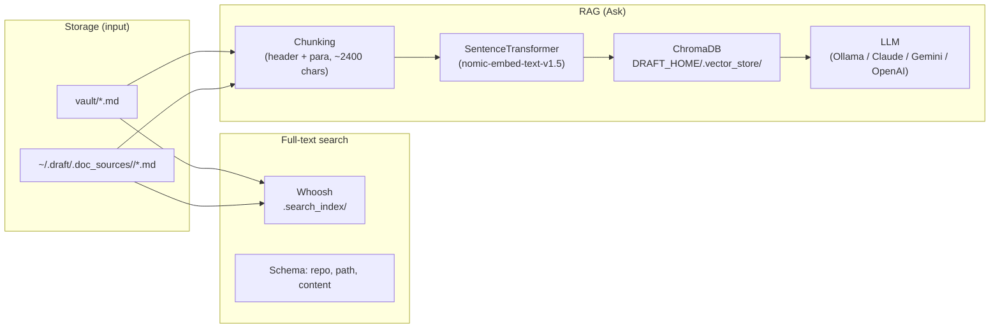

# Intelligence Layer Design: Search, Embeddings, and RAG (Ask)

**Scope:** Full-text search, vector embeddings, and the Ask (RAG) feature. This layer reads from the **storage layer** (**`~/.draft/vault/`** and **`~/.draft/.doc_sources/`**, or `DRAFT_HOME`) and the **metadata layer** (manifest is not yet used here; see storage-and-metadata-design.md for re-link and content_hash plans). The intelligence layer is **read-only** with respect to source files: it builds and queries indexes; it does not modify docs or config.

**Goals:** (1) **Search** — fast full-text lookup over all `.md` docs. (2) **Ask** — answer user questions using only the user’s docs (RAG: retrieve relevant chunks, then LLM with strict context-only prompting). (3) Keep search and RAG simple, reproducible, and configurable (local vs cloud LLM, one embedding model).

---

## Architecture

**Data flow:**

- **Search:** Storage → Whoosh index (build from **`~/.draft/vault/`** + **`~/.draft/.doc_sources/`**) → **GET /api/search?q=...** → results with repo, path, snippet.
- **Ask:** Storage → chunking → embed → Chroma; at query time: embed query → Chroma similarity → top-k chunks → LLM with context → streamed answer + citations.

Indexes are **rebuilt on demand** (no incremental updates today). Search index is rebuilt when the user runs **Pull** from the UI or **Reindex**. Vector index is rebuilt only when the user runs **Rebuild AI index** or **`scripts/index_for_ai.py`**.

---

## 1. Full-Text Search (Whoosh)

### 1.1 Role

- Fast keyword/phrase search over all indexed `.md` files.
- Used by the UI search box; independent of the vector store and LLM.

### 1.2 Location and schema

| Item        | Value |
|------------|--------|
| **Index dir** | `DRAFT_ROOT/.search_index/` |
| **Schema** | `repo` (ID), `path` (ID), `content` (TEXT, stored) |
| **Source** | **`~/.draft/vault/`** and **`~/.draft/.doc_sources/<repo>/`** — same roots as pull and ingest |

Implementation: `ui/search_index.py` (or project-level `lib` if factored out). Whoosh handles tokenization and scoring; snippets are produced via `hit.highlights("content")` with Whoosh’s default highlighter (HTML tags stripped for plain text).

### 1.3 Build and query

- **Build:** `build_index(draft_root)` — clears existing index, walks `~/.draft/vault/` and `~/.draft/.doc_sources/`, adds each `.md` as one document. No exclusions are applied in the current search index (pull/ingest use README.md, CLAUDE.md, and directory exclusions; search could be aligned later).
- **Query:** `search(draft_root, q, limit=50)` → list of `{"repo", "path", "snippet"}`.
- **When rebuilt:** After **Pull** in the UI (api_pull calls `search_index.build_index`); or explicitly via POST `/api/reindex`. Not rebuilt by CLI pull or by add-source alone.

### 1.4 API

- **GET /api/search?q=...** — Returns `{"results": [{"repo", "path", "snippet"}, ...]}`. Builds index if missing (`ensure_index`).

---

## 2. Chunking

### 2.1 Role

- Split markdown into **logical segments** for embedding and retrieval: one chunk = one or more paragraphs under a section, with a size cap and optional overlap.
- Ensures the LLM receives coherent, bounded context (not whole files).

### 2.2 Strategy

| Parameter | Value | Notes |
|-----------|--------|--------|
| **Unit** | Section (## / ###) then paragraphs | Sections from headers; within section, split by paragraph. |
| **Max size** | ~2400 chars (~600 tokens) | `CHUNK_MAX_CHARS` in `lib/chunking.py`. |
| **Overlap** | 1 paragraph | Reduces boundary effects between chunks. |

Implementation: `lib/chunking.py`. `chunk_markdown(repo, path, content)` returns a list of `Chunk` with `text`, `repo`, `path`, `heading`, `chunk_index`.

### 2.3 Metadata per chunk

- **repo** — Source id (vault or repo name under `~/.draft/.doc_sources/`).
- **path** — Relative path within that source (e.g. `docs/foo.md`).
- **heading** — Section heading (from ## or ###) or empty.
- **chunk_index** — Order within the file.

Used for: Chroma document metadata and for **citations** in the Ask UI (repo/path/heading). **content_hash** is not yet stored (planned for re-link; see storage-and-metadata-design.md).

---

## 3. Vector Store (Chroma) and Embeddings

### 3.1 Role

- Store **embeddings** of chunk text for semantic similarity.
- At Ask time: embed the user query, retrieve top-k similar chunks, pass them as context to the LLM.

### 3.2 Locations and model

| Item | Value |
|------|--------|
| **Persist dir** | `DRAFT_HOME/.vector_store/` (e.g. `~/.draft/.vector_store`) |
| **Collection** | `draft_docs` (single collection) |
| **Embedding model** | `nomic-ai/nomic-embed-text-v1.5` (SentenceTransformer, `trust_remote_code=True`) |
| **Cache** | `DRAFT_ROOT/.cache/huggingface` when running `scripts/index_for_ai.py` (env in script) |

Implementation: `lib/ingest.py` (build), `lib/ai_engine.py` (retrieve). Same embedding model is used for **indexing** and for **query** encoding so distances are comparable.

### 3.3 Schema (Chroma)

- **Stored per chunk:** `ids` (e.g. `chunk_0`, `chunk_1`), `embeddings`, `documents` (raw text), `metadatas`: `repo`, `path`, `heading`.
- **Not yet stored:** `content_hash` (planned for re-link and dedup; see storage-and-metadata-design.md).

### 3.4 Build

- **Build:** `lib.ingest.build_index(draft_root, verbose)`:
  - Collect chunks from `~/.draft/vault/` + `~/.draft/.doc_sources/` (same exclusions as pull: README.md, CLAUDE.md, exclude dirs).
  - Delete existing `draft_docs` collection and create a new one.
  - Encode all chunk texts with the SentenceTransformer model; add to Chroma with ids, embeddings, metadatas, documents.
- **Trigger:** User runs **Rebuild AI index** in the UI (POST `/api/reindex_ai`) or `python scripts/index_for_ai.py`. **Not** triggered by Pull or add-source.

### 3.5 Retrieve

- **Retrieve:** `lib.ai_engine.retrieve(draft_root, query, top_k=5)`:
  - Load collection; encode `query` with the same embedding model.
  - `collection.query(query_embeddings=..., n_results=min(top_k, 20), include=["metadatas", "documents"])`.
  - Return list of `{"repo", "path", "heading", "text"}` for the top-k chunks.

---

## 4. RAG (Ask): Retrieve + LLM

### 4.1 Flow

1. **Retrieve** — `retrieve(draft_root, query, top_k=5)` → list of chunks.
2. **Context** — Format chunks as a single context string with labels `[Source i: repo/path — heading]\n<text>` (text truncated per source for safety).
3. **LLM** — System prompt: answer only from context; do not guess; cite doc/section when relevant. User message: context + question.
4. **Stream** — LLM response is streamed (SSE); at the end, emit citations (same top-k sources).
5. **Output** — SSE events: `text` (delta), `citations` (list of repo/path/heading), `error` (if any).

Implementation: `lib/ai_engine.py` (`ask_stream`), `ui/app.py` (POST `/api/ask` → SSE).

### 4.2 LLM configuration

Provider and model are chosen via **environment variables** (loaded from `DRAFT_ROOT/.env` on Ask, e.g. by `dotenv` in app startup and in `_ensure_env_loaded` before calling the LLM).

| Variable | Purpose |
|----------|---------|
| **DRAFT_LLM_PROVIDER** | `ollama` \| `claude` \| `gemini` \| `openai` |
| **DRAFT_LLM_MODEL** | Override model name (e.g. `claude-3-5-sonnet-20241022`, `gpt-4o-mini`) |
| **OLLAMA_MODEL** | Local model for Ollama (e.g. `qwen3:8b`) |
| **ANTHROPIC_API_KEY** | Claude |
| **GEMINI_API_KEY** or **GOOGLE_API_KEY** | Gemini |
| **OPENAI_API_KEY** | OpenAI |

**Fallbacks:** If `DRAFT_LLM_PROVIDER` is unset, provider is inferred: `CLOUD_AI_MODEL` set → Gemini; `LOCAL_AI_MODEL` or `OLLAMA_MODEL` set → Ollama. Default local model: `qwen3:8b`.

Setup: `setup.sh` “Configure Ask (AI) LLM” and `scripts/setup_env_writer.py` write these into `.env`.

### 4.3 API

- **POST /api/ask** — Body: `{"query": "..."}`. Returns SSE stream: `data: {"type":"text","text":"..."}`, `data: {"type":"citations","citations":[...]}`, `data: {"type":"error","error":"..."}`.
- **GET /api/llm_status** — Returns `{"provider": "...", "model": "..."}` for the UI (no secrets).

---

## 5. Indexing Triggers (Summary)

| Action | Search index (Whoosh) | Vector index (Chroma) |
|--------|------------------------|------------------------|
| **Pull (UI)** | Rebuilt | No |
| **Pull (CLI)** | No | No |
| **Add source (UI)** | Rebuilt (via pull inside add) | No |
| **Reindex (UI)** | Rebuilt | No |
| **Rebuild AI index (UI)** | No | Rebuilt |
| **scripts/index_for_ai.py** | No | Rebuilt |

So: **Search** is updated when the user pulls or reindexes from the UI; **Ask** is updated only when the user explicitly rebuilds the AI index. There is no single “refresh everything” pipeline today (see storage-and-metadata-design.md §7.5).

---

## 6. File Exclusions and Sources

Both **search** and **ingest** read from:

- **~/.draft/vault/** — All `.md` under vault (except exclusions below).
- **~/.draft/.doc_sources/<repo>/** — One directory per repo in sources.yaml (after pull).

**Exclusions** (in ingest and pull; search currently indexes all .md under the same dirs):

- Top-level filename: `README.md` (excluded in ingest/pull).
- Basename: `CLAUDE.md`.
- Directory names: `.claude`, `.cursor`, `.vscode`, `.pytest_cache`, `.venv`, `.git`, `__pycache__`, `.tmp`, `.adk`.

Aligning search with these exclusions is a possible improvement so search and Ask see the same set of files.

---

## 7. Future and Possible Extensions

- **content_hash in Chroma** — Add SHA-256 of source file to chunk metadata and to a file registry for re-link without re-embedding (see storage-and-metadata-design.md).
- **Incremental vector index** — Update only changed/new files instead of full rebuild (would require file registry + mtime or hash).
- **Hybrid search** — Combine Whoosh (keyword) and Chroma (semantic) for Ask (e.g. retrieve from both and merge/rerank).
- **Configurable embedding model** — Implemented: `DRAFT_EMBED_MODEL` in `.env` overrides the default; setup.sh option 2 lets you choose or type a custom model.
- **Search exclusions** — Apply the same exclude list in `ui/search_index.py` as in ingest/pull so search and RAG see the same docs.
- **RAG tuning** — Adjust `TOP_K`, context length, or add reranking; keep “answer only from context” as the default policy.

---

## 8. Implementation Summary

| Component | Module / script | Key entry points |
|-----------|-----------------|-------------------|
| Full-text search | `ui/search_index.py` | `build_index`, `search`, `ensure_index` |
| Chunking | `lib/chunking.py` | `chunk_markdown`, `Chunk` |
| Vector build | `lib/ingest.py` | `collect_chunks`, `build_index` |
| Vector query + LLM | `lib/ai_engine.py` | `retrieve`, `ask_stream` |
| CLI vector build | `scripts/index_for_ai.py` | `main()` → `ingest.build_index` |
| API | `ui/app.py` | GET `/api/search`, POST `/api/ask`, GET `/api/llm_status`, POST `/api/reindex`, POST `/api/reindex_ai` |

This design stays compatible with the storage and metadata layers: intelligence reads from `~/.draft/vault/` and `~/.draft/.doc_sources/`; when the metadata layer adds a file registry and content_hash, the intelligence layer can be extended to store and use content_hash in Chroma without changing the overall flow.
