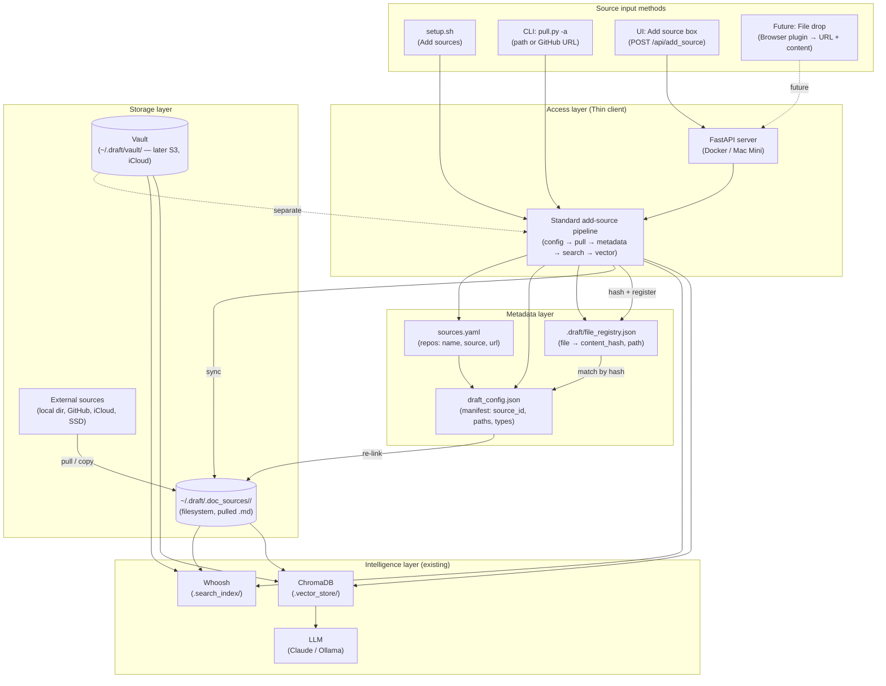

# Storage & Metadata Design: Access Layer and Reconnection

**Scope:** Storage layer + access layer. Intelligence layer (embeddings, Chroma, LLM) is out of scope for this design. Goal: **re-connect with storage after it is detached** using content identity (hashing) and path mapping; support future browser-drop with URL as source.

**Data locations:** Doc data lives under **`~/.draft/`** (or **`DRAFT_HOME`**): **`.doc_sources/<source_id>/`** for pulled sources and **`vault/`** for the vault. The repo root holds code and `sources.yaml` only.

**copy/sync source files into `~/.draft/.doc_sources/<source_id>/`** for all non-vault sources (pull from GitHub, copy from local paths). **Vault** lives in **`~/.draft/vault/`** (outside `.doc_sources/`). The tree, search, and Ask read vault from `~/.draft/vault/` and other docs from `~/.draft/.doc_sources/`. This design **adds a meta layer on top**—manifest, file registry, content hashing—for reconnection and portability; it does not replace the existing "sync into .doc_sources" flow.

---

## Architecture diagram



**Legend:**

- **Source input methods:** All feed into the same **standard add-source pipeline** (or will, once unified). File drop is future (browser plugin).
- **Access layer:** FastAPI backend; runs the pipeline (config → pull → metadata → search → vector).
- **Metadata layer:** `sources.yaml` (human-editable), `draft_config.json` (manifest for re-link), `.draft/file_registry.json` (file → content_hash). Updated by the pipeline when sources are added or paths change.
- **Storage layer:** **Vault** lives at **`~/.draft/vault/`** (later configurable to encrypted S3, iCloud, etc.). **`~/.draft/.doc_sources/`** is the filesystem for pulled sources only. Pull/copy fills `~/.draft/.doc_sources/<source_id>/`; Draft reads vault from `~/.draft/vault/` and other docs from `~/.draft/.doc_sources/`.
- **Intelligence layer:** Whoosh (full-text) and Chroma (vectors) are rebuilt from `~/.draft/.doc_sources/` (and vault) by the pipeline; LLM uses Chroma for Ask.

---

## 1. Principles

- **Draft "watches" files** — it does not own them. Sources live on external drive, iCloud, GitHub, etc. Pull/copy still populates `~/.draft/.doc_sources/` with the resulting `.md` files.
- **Content identity over path** — we track files by a **content hash** (SHA-256). When the path changes (e.g. drive moved), we **re-link** existing vectors to the new path instead of re-indexing.
- **Manifest is the single source of truth** for "what sources exist and where they map." It is portable and can live next to the vault or in a known location so the thin client can re-attach.
- **Meta layer only** — Manifest, file registry, and hashes are additive. Reading and serving docs come from `~/.draft/vault/` and `~/.draft/.doc_sources/`; the meta layer enables re-link and future features without changing how files get there.
- **Vault is separate** — Vault is not under `.doc_sources/`. It lives at **`~/.draft/vault/`** (or `DRAFT_HOME/vault/`) so it can later be pointed at an encrypted S3 bucket, iCloud Drive, etc. **`~/.draft/.doc_sources/`** remains a plain filesystem for pulled/copied docs.

---

## 2. Artifacts and Locations

| Artifact | Location | Role |
|----------|----------|------|
| **Manifest** | `.draft/draft_config.json` at draft root | **Generated** from `sources.yaml` + resolved paths (see §2.1). **Implemented.** Verify required before build. Machine-readable; used for tooling; re-link will use it when file registry exists. |
| **Sources list** | `sources.yaml` | **Single source of truth** for humans: list of repos (name, source, url). See §2.1 below. |
| **Vault** | **`~/.draft/vault/`** (or `DRAFT_HOME/vault/`) | **Separate from .doc_sources.** Holds curated/private docs; can later be backed by encrypted S3, iCloud, etc. Not written by pull. |
| **Doc store (filesystem)** | **`~/.draft/.doc_sources/<source_id>/`** | Pull/copy writes here (GitHub fetch, local copy). Vault is *not* here. The meta layer sits on top. |
| **File registry** | `.draft/file_registry.json` (path in manifest) | **Not yet implemented.** Planned: list of known files with hash + source_id + relative path (for re-link). |
| **Vector store** | `.vector_store/` (Chroma) | Stores chunk embeddings + metadata; chunk metadata includes `source_id`, `path`, and **content_hash** (see below). |
| **Search index** | `.search_index/` (Whoosh) | Full-text index; can be rebuilt from `~/.draft/.doc_sources` (and vault) if needed. |

---

### 2.1 Single source of truth: avoid double sync

**The friction:** Having both `sources.yaml` (human) and `draft_config.json` (machine) creates two sources of truth. If both are edited, they can drift and require manual sync—not optimal.

**Recommendation: one canonical, one derived.**

- **`sources.yaml` is the only human-edited config.** People (and the UI/CLI add-source flow) add or change sources here. It stays minimal: repo name, `source` (path or URL), optional `url`.
- **`draft_config.json` is always generated**, never hand-edited. The access layer (or a small job) produces it from:
  - **sources.yaml** (list of sources),
  - **resolved paths** (e.g. for vault use `~/.draft/vault/`; for pulled repos use `~/.draft/.doc_sources/<name>/`; for other local sources resolve against repo root),
  - optional **file registry** (hashes for re-link).

So there is no “double sync”: **sources.yaml is canonical**; **draft_config.json is a derived cache**. Regenerate the manifest on pull/add-source, on startup, or when the user runs “Reconnect storage.” Each regeneration **replaces** the manifest entirely from the current YAML (no merge), so **dropped sources are trimmed automatically**—there is no separate prune step. No human ever edits `draft_config.json`. **Verification is mandatory before building the manifest:** `update_manifest()` runs `verify_sources_yaml()` first and raises if `sources.yaml` is invalid, so `draft_config.json` is never written from invalid config. Setup, UI add-source, and comments in `sources.yaml` tell users to run `python scripts/verify_sources.py` after editing by hand.

**Alternative (if you prefer one file):** Use only `sources.yaml` and have the code resolve paths and build the “manifest” in memory when needed. Persist the file registry (hashes) separately. Then there is no second config file at all; re-link and path mapping use in-memory state plus the registry. That’s simpler; the only downside is that tools or scripts that want a stable JSON manifest need to generate it on demand from `sources.yaml` + scan.

---

## 3. Metadata: What We Store

### 3.1 Source-level (manifest / draft_config.json)

Each source has a stable **source_id** (current repo name) and:

| Field | Type | Purpose |
|-------|------|---------|
| `source_id` | string | Stable id (e.g. `vault`, `MarginCall`, `shanjing_adk-lab`). |
| `source_type` | enum | `vault` \| `github` \| `local` \| `cloud` \| `url` (future: browser drop). |
| `source` | string | Original location: path (relative/absolute) or URL. Used for pull and for display. |
| `url` | string \| null | Git origin or null. |
| `resolved_path` | string \| null | Current resolved path to the root of this source (for local/vault). Updated when user "re-maps" the path; allows re-link without re-index. |
| `last_seen_at` | ISO8601 \| null | Last time the access layer successfully read this source (optional). |

**Future (browser drop):**

| Field | Type | Purpose |
|-------|------|---------|
| `origin_url` | string | Page URL the document was dropped from. |
| `drop_timestamp` | ISO8601 | When it was added. |
| `content_type` | string | e.g. `text/markdown`, `text/html` (for reconstruct/reload). |

### 3.2 File-level (for re-link and future reload)

**Status: Not yet implemented.** Planned: stored in **file registry** (e.g. `.draft/file_registry.json`) or as a sidecar next to the manifest. Chroma chunk metadata should include at least one content identifier (e.g. `content_hash`) so we can match chunks to files after re-link.

| Field | Type | Purpose |
|-------|------|---------|
| `source_id` | string | Which source this file belongs to. |
| `path` | string | Relative path inside the source (e.g. `docs/foo.md`). |
| `content_hash` | string | **SHA-256** of file content (hex). Primary key for re-link: same hash ⇒ same content ⇒ re-link, don’t re-embed. |
| `mtime` | number \| null | Last modified time (mtime) at index time (optional; for quick "dirty" check). |
| `origin_url` | string \| null | Future: URL if file came from browser drop. |
| `content_type` | string \| null | Future: e.g. `text/markdown`. |

**Chroma chunk metadata (add to current):**

**Status: Not yet implemented.** Current: `repo`, `path`, `heading`. Planned addition:

| Field | Type | Purpose |
|-------|------|---------|
| `content_hash` | string | SHA-256 of the **file** this chunk came from. Enables "which file does this chunk belong to" after path change. |

Chunk ID can stay `chunk_0`, `chunk_1`, etc.; we use `content_hash` + `path` + `source_id` to know which file a chunk belongs to when re-linking.

### 3.3 Tools and protocols

| Concern | Tool / protocol | Notes |
|---------|-----------------|--------|
| **Content identity** | **SHA-256** (hex) of raw file bytes | Prefer SHA-256 over MD5 for security and portability. One hash per file. |
| **Path mapping** | Manifest `resolved_path` (and optional file_registry) | User updates path when drive/location changes; we do not re-embed if hashes match. |
| **Source config** | JSON manifest (`draft_config.json`) | Single file, easy to backup/sync with vault. |
| **Re-link flow** | 1) Read manifest and file registry. 2) For each source, resolve new path. 3) Scan files, compute SHA-256. 4) Match by hash to existing registry; update path in registry. 5) Chunks already in Chroma keyed by (source_id, path, content_hash) — no re-index. 6) If hash unknown (new file), index as today. | Ensures "detach then reattach" only updates paths, not vectors. |

---

## 4. Manifest Schema (draft_config.json)

**Status: Implemented.** Generated by `lib/manifest.py` from `sources.yaml`; written to `.draft/draft_config.json` on app startup and at end of pull. Verify (`verify_sources_yaml`) runs before build and raises if yaml is invalid. Source types today: `vault`, `github`, `local`. The `source_type: url` / browser-drop entry below is **not yet implemented**.

```json
{
  "version": 1,
  "sources": {
    "vault": {
      "source_type": "vault",
      "source": "./vault",
      "resolved_path": "/home/user/.draft/vault",
      "url": null
    },
    "MarginCall": {
      "source_type": "local",
      "source": "./.doc_sources/MarginCall",
      "resolved_path": "/home/user/.draft/.doc_sources/MarginCall",
      "url": "https://github.com/..."
    },
    "browser-drop-1": {
      "source_type": "url",
      "origin_url": "https://example.com/doc.md",
      "drop_timestamp": "2025-02-20T12:00:00Z",
      "content_type": "text/markdown"
    }
  },
  "file_registry_path": ".draft/file_registry.json"
}
```

- **sources.yaml** can remain the human-facing list; a job (or the backend on startup) can sync it into `draft_config.json` and fill `resolved_path` from current filesystem.
- **file_registry** can be a separate JSON array of file records (source_id, path, content_hash, mtime, optional origin_url, content_type) so the manifest stays small.

---

## 5. File Registry Schema

**Status: Not yet implemented.** The manifest references `file_registry_path: ".draft/file_registry.json"`, but the registry file is not written or read. Re-link and content_hash in chunk metadata depend on this.

**Proposed** schema:

```json
[
  {
    "source_id": "vault",
    "path": "DRAFT.md",
    "content_hash": "a1b2c3...",
    "mtime": 1739123456.0
  },
  {
    "source_id": "MarginCall",
    "path": "docs/readme.md",
    "content_hash": "d4e5f6...",
    "mtime": 1739123400.0
  }
]
```

- **Re-link:** When the user points a source to a new path, we scan that path for `.md` files, compute SHA-256, and match to this registry. For matches we update the in-memory (or persisted) "current path" for that source; Chroma chunks are already identified by (source_id, path, content_hash), so no re-embed. New hashes ⇒ new files ⇒ index as today.

---

## 6. Reconnection Flow (High Level)

**Status:** Step 1 uses the manifest (implemented). Steps 2–4 depend on file registry and re-link logic (**not yet implemented**).

1. **Load manifest** — Read `draft_config.json` (and optionally `sources.yaml`). Resolve each source’s current path (resolved_path or re-resolve from `source`).
2. **Load file registry** — If present, load list of (source_id, path, content_hash).
3. **Re-link (path changed)** — For each source with a new `resolved_path` (e.g. user updated after moving the drive): scan new path, hash each file. For each hash that exists in the registry under that source_id, treat as same file (path may have moved); update registry path if needed. Do **not** re-embed; Chroma already has chunks for that content_hash/source_id/path.
4. **Serve** — Backend serves from current `resolved_path` (e.g. `~/.draft/vault`, `~/.draft/.doc_sources/<name>`); vector store stays as-is unless new files appear (then incremental index by hash).

---

## 7. Add-Source Flow: Scenarios and Standard Interface

### 7.1 What are "the configurations"?

Today the only persisted configuration for sources is **`sources.yaml`**:

- **What it is:** A list of repos; each has a **name** (source_id), **source** (path or GitHub URL), and optional **url** (git origin).
- **Who writes it:** `scripts/pull.py` when you add a repo (`-a` / `do_add_repo`). Setup.sh and the UI "Add source" both go through `pull.py -a`.
- **Who reads it:** `pull.py` (pull), `ui/app.py` (tree), and any code that needs the list of sources.

The **meta layer** adds:

- **draft_config.json** (manifest) — **Implemented.** source_id → source_type, source, resolved_path, url. Generated from sources.yaml; verify required before build.
- **.draft/file_registry.json** — **Not yet implemented.** Per-file hash + path for re-link.

So today: **sources.yaml** + **draft_config.json** (generated). Optional **file_registry.json** is planned.

---

### 7.2 Scenario 1: What happens when a new source is added?

**Current behavior:**

| Step | What happens | Config updated? |
|------|----------------|------------------|
| User adds source (see 7.4) | `pull.py -a <arg>` runs (CLI or via API). | — |
| `do_add_repo()` | Appends one block to **sources.yaml** (name + source + optional url). | **sources.yaml** ✓ |
| `do_pull()` | Creates `~/.draft/.doc_sources/<name>/` and copies/fetches `.md` files (GitHub API or local copy). At end, **draft_config.json** is regenerated (verify then build). | **draft_config.json** ✓ |
| Tree | Next load reads sources.yaml + `~/.draft/.doc_sources/` → new repo appears. | — |
| Search (Whoosh) | **Not** updated by add_source. Updated only when user clicks **Pull** (api_pull rebuilds search index). | — |
| Vector / Ask (Chroma) | **Not** updated by add_source or by Pull. User must click **Rebuild AI index**. | — |

So today:

- **Configurations updated automatically:** Only **sources.yaml** (and the files on disk under `~/.draft/.doc_sources/<name>/`).
- **Search index:** Updated when user runs **Pull** from the UI (because api_pull calls `search_index.build_index` after pull). If the user adds a source via **setup.sh** or **CLI only**, search is not updated until they run Pull from the UI or reindex manually.
- **Vector index:** Never updated automatically; user must run "Rebuild AI index."

**With the meta layer (current vs planned):**

- **draft_config.json:** **Implemented.** Adding a source (or running pull) updates **sources.yaml** and, at end of pull and on app startup, **draft_config.json** is regenerated (new source entry + resolved_path). Verify runs before building the manifest.
- **file_registry:** **Not yet implemented.** Per-file content_hash and `.draft/file_registry.json` are not written; re-link is not available.
- **Single standard pipeline** (add source → config → pull → search → vector): **Not yet implemented.** Search is rebuilt only when Pull is run from the UI; vector index is never updated automatically (see §7.5).

---

### 7.3 Manual edit of sources.yaml: what happens and what to do next?

If a user **manually edits sources.yaml** and adds a new repo (e.g. pastes a new block with name and source), the following is true:

- **Tree:** The new source will **not** appear in the sidebar until the repo directory exists. For non-vault sources that means `~/.draft/.doc_sources/<name>/` must exist and contain files—i.e. they must run **Pull** first. For vault, the directory is `~/.draft/vault/`.
- **Manifest:** `draft_config.json` is regenerated **on app startup** and **at the end of every Pull**. So after a manual edit, either restart the app or run Pull; then the manifest will include the new source (with `resolved_path` once the path exists).
- **Files:** Nothing is fetched or copied until the user runs **Pull**. Pull reads sources.yaml and for each entry (except vault) fetches from GitHub or copies from the local path into `~/.draft/.doc_sources/<name>/`.

**Next steps to get manually added sources into the system:**

1. **Run Pull** (UI: **Pull** button, or CLI: `python scripts/pull.py`).  
   This creates `~/.draft/.doc_sources/<name>/`, fetches/copies `.md` files, and regenerates the manifest. If you use the **UI** Pull button, the **search index** is also rebuilt automatically.

2. **Search (full-text):**  
   - If you used the **UI** Pull button, search is already updated.  
   - If you used the **CLI** only, trigger **Reindex** (UI “Rebuild search” or `POST /api/reindex`) so the new docs are searchable.

3. **Ask (AI / RAG):**  
   Rebuild the vector index: click **Rebuild AI index** in the UI, or run `python scripts/index_for_ai.py`, or `POST /api/reindex_ai`. This is never done automatically by Pull.

So after a manual edit: run **`python scripts/verify_sources.py`** to check structure (and `--check-paths` to warn if dirs are missing); then **Pull** (then **Reindex** search if you pulled via CLI), then **Rebuild AI index** if you want the new source in Ask.

---

### 7.4 Are config updates supported by all input methods?

| Input method | How it adds a source | sources.yaml updated? | ~/.draft/.doc_sources populated? | Search index updated? | Vector index updated? |
|--------------|----------------------|------------------------|--------------------------|------------------------|-------------------------|
| **setup.sh** "Add new sources" | Prompts for path or GitHub URL; runs `pull.py -a <arg>`. | ✓ Yes | ✓ Yes (do_pull) | ✗ No (no call to reindex) | ✗ No |
| **UI "Add source" box** | User types path or URL; POST /api/add_source → `pull.py -a source --quiet`. | ✓ Yes | ✓ Yes (do_pull inside -a) | ✓ Yes* (*UI then calls api_pull, which rebuilds search) | ✗ No |
| **CLI** `python scripts/pull.py -a ../MyRepo` | Same as setup.sh path flow. | ✓ Yes | ✓ Yes | ✗ No | ✗ No |

So:

- **sources.yaml** and **~/.draft/.doc_sources/** are updated by **all** input methods (they all go through `pull.py -a`).
- **Search index** is updated only when the **UI** is used (because the UI triggers an extra Pull, which rebuilds search). Setup and CLI do not trigger search reindex.
- **Vector index** is **never** updated automatically by any method.

There is **no single standard interface** today that guarantees: add source → update config → pull → update search → update vector (and in the future, manifest + file registry). Each entry point does slightly different things.

---

### 7.5 Standard interface: one pipeline for "add source" and downstream updates

**Goal:** Every way of adding a source should go through the same pipeline so that configurations, metadata, search, and vector index stay in sync.

**Proposed standard flow:**

1. **Accept source** (one canonical API or CLI entry).
   - Input: source spec (local path, GitHub URL, or future: URL + content type for browser drop).
   - Validation: resolve path or URL; ensure name/source_id is unique.
2. **Update configurations.**
   - Write **sources.yaml** (append or update one repo).
   - When meta layer exists: update **draft_config.json** (add/update one source entry; set resolved_path).
3. **Sync files.**
   - Run pull for that source (or full pull): write `~/.draft/.doc_sources/<source_id>/`.
4. **Update metadata (when meta layer exists).**
   - Scan new/changed files under `~/.draft/.doc_sources/<source_id>/`; compute content_hash; update **file_registry**.
5. **Update search index.**
   - Rebuild Whoosh index from `~/.draft/.doc_sources/` (full rebuild or incremental if we add it later).
6. **Update vector index.**
   - Rebuild Chroma from `~/.draft/.doc_sources/` (full rebuild or incremental), including content_hash in chunk metadata.

**Single entry points that should call this pipeline:**

- **CLI:** `pull.py -a <source>` (or a dedicated `draft add-source <source>` that delegates to the same backend).
- **UI:** POST `/api/add_source` → backend runs the full pipeline (no second "Pull" needed from the frontend).
- **setup.sh:** When user adds sources, call the same CLI/API so behavior matches.

**Backend shape:** Prefer one internal function, e.g. `add_source_and_sync(draft_root, source_spec)`, that performs steps 1–6 (and in the future, manifest + file_registry updates). The API and CLI both call it. Then all input methods update configurations, metadata, search, and vector index consistently.

---

## 8. Future: Browser Drop

- **Drop action:** Plugin sends current page URL + content (or URL only and backend fetches). Backend creates a new source of type `url` and a file in `~/.draft/.doc_sources/<source_id>/` (e.g. sanitized filename + `.md`).
- **Metadata to store:** `origin_url`, `drop_timestamp`, `content_type` in manifest and in file registry (and optionally in Chroma metadata) so Draft can **reconstruct and reload** (e.g. re-fetch from URL or show "origin: …" in UI).

---

## 9. Implementation Order (Suggested)

1. **Standard add-source pipeline** — **Not yet done.** Unify add-source so that API, CLI, and setup.sh all call one path that: updates sources.yaml → pull → rebuild search index → rebuild vector index (see §7.5).
2. **Add content_hash to file handling** — **Not yet done.** When indexing, compute SHA-256 per file; store in Chroma chunk metadata and in `.draft/file_registry.json`.
3. **Introduce draft_config.json** — **Done.** Written from `sources.yaml` + resolved paths by `lib/manifest.py`; updated on pull and app startup; verify runs before build. Path referenced in manifest; not yet used for path resolution in access layer.
4. **Re-link logic** — **Not yet done.** On startup (or "Reconnect storage"), resolve paths from manifest, scan files, match by hash to registry; update paths without re-embedding.
5. **Later:** Browser plugin + `source_type: url`, `origin_url`, `content_type`, `drop_timestamp` in manifest and registry for reconstruct/reload.

**Also implemented:** sources.yaml verification (`scripts/verify_sources.py`, `lib/verify_sources.py`); verify is mandatory before building the manifest; setup.sh runs verify before using sources; UI runs verify after add_source.

This keeps the intelligence layer unchanged while making the **access and storage layers** reconnection-ready and metadata-rich for portability and future features.
