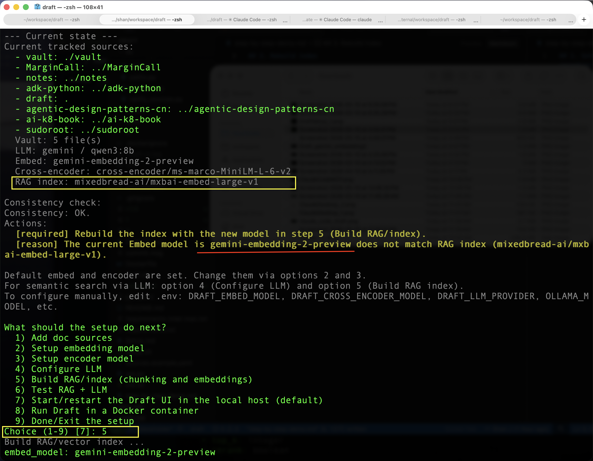
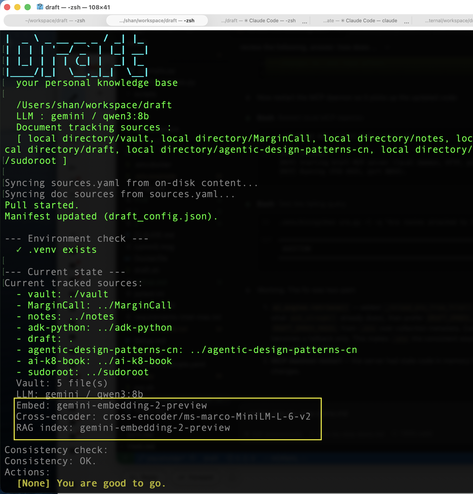
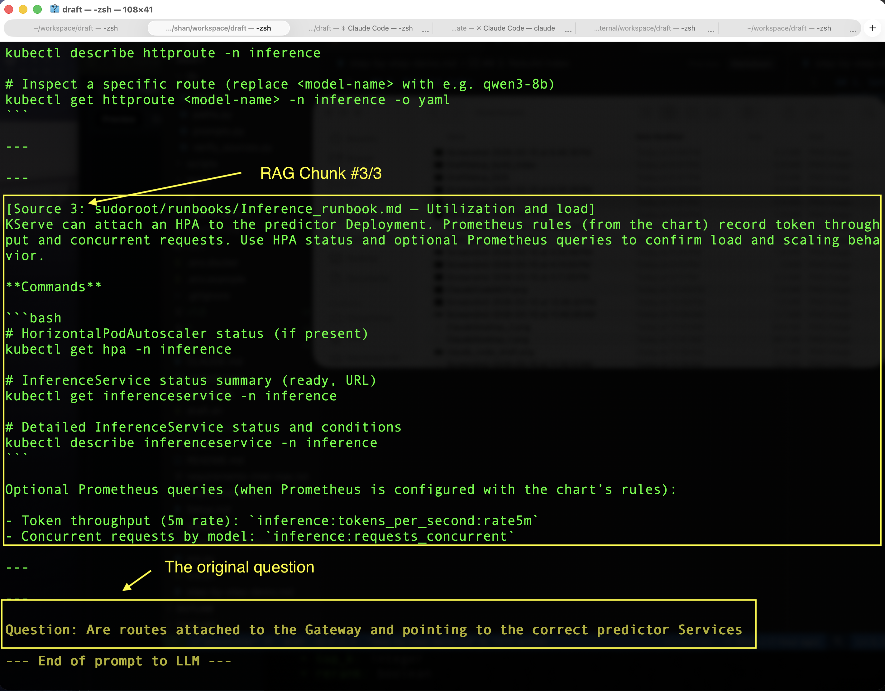
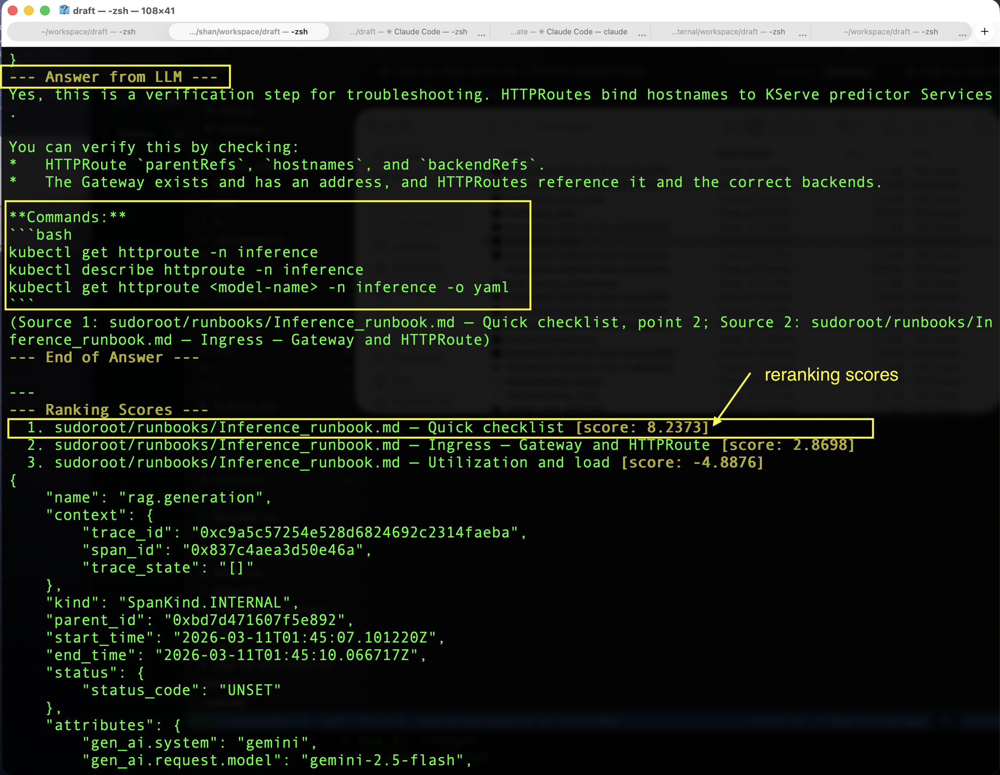

## 1. Setup document sources, embedding model, encoding/rerankign model, LLM models

This is a quick walkthrough on how to set the embedding models using setup.sh

- In setup.sh see the discrencies between "Embeded: model" and "RAG index: model". This will require to reindex the vector DB in order to query the RAG. 
Pick option 5 to reindex the vector DB.


- Once the indexing is completed, both "Embeded" and "RAG index" have the identical model name. You can also run a query test right after building the index, option 6.


## 2. Semantic search with ask.py

This is a walkthrough on how to make semantic/LLM querys using CLI ask.py (--show-prompt option) with the debugging option to exam the prompts (contains the RAG chunks) sent to the LLM.

- ask.py asks the following question
```bash
source .venv/bin/activate
python scripts/ask.py --show-prompt -q "Are routes attached to the Gateway and pointing to the correct predictor Services?"
```
- ask.py retrieved chunks from the vector DB and sent the prompt with RAG chunks to the LLM



- LLM responses with reranking scores for reference/debugging of RAG.



## 3. Rebuild index
```bash
./setup.sh # option 5 (recommend)
```
or from CLI:
```bash
python scripts/index_for_ai.py --profile quick #or deep, see RAG_operations.md
```
